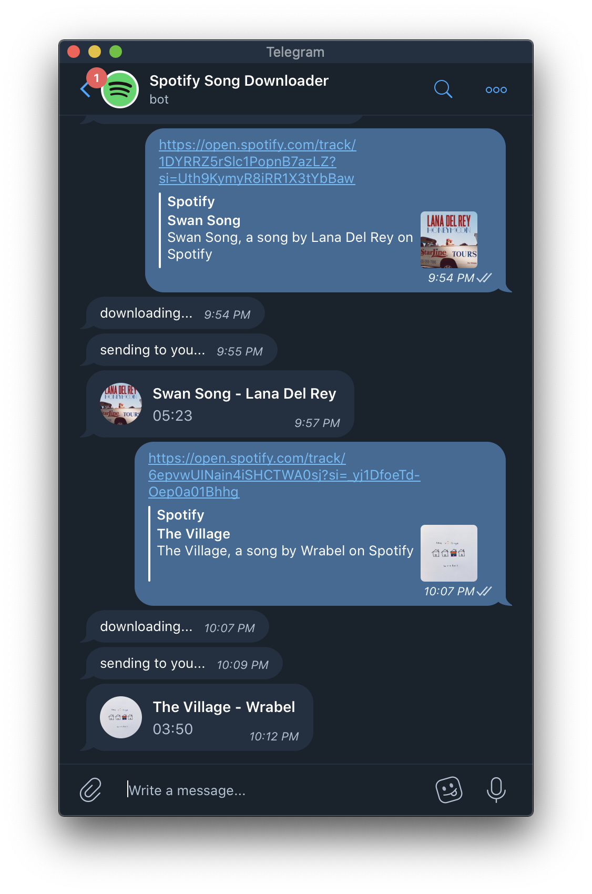

# TelegramSpotifyDownloader

## What is it?
This is a simple bot to download songs from YouTube in an MP3 format by using Spotify's HTTP link. This bot uses [spotdl](https://github.com/ritiek/spotify-downloader) to do that!



## How to run?

First of all you should add your bot `TOKEN` to config file.

Then install requirements:
```
pip install requirements
```

Then you can run program with this command:
```
python main.py
```

